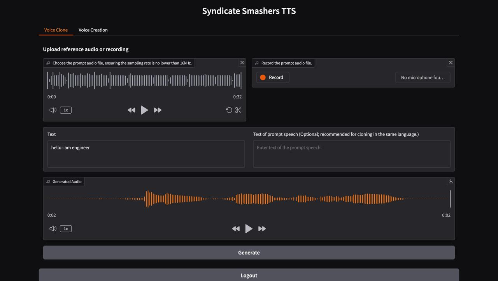
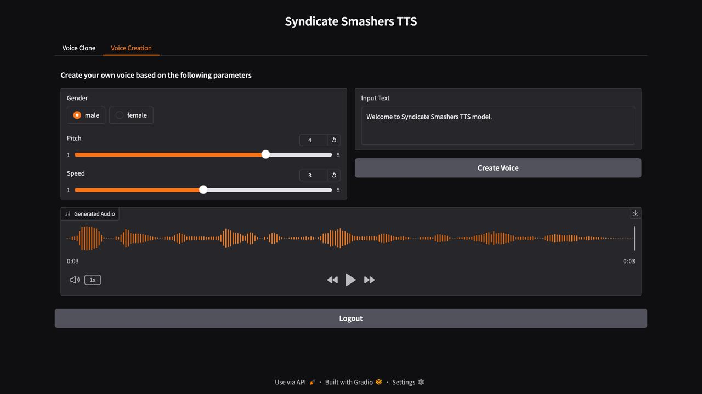

<div align="center">
    <h1>
    Syndicate Smashers
    </h1>
    <p>
    Prodigal.AI <> KodeKurrent <br>
    <b><em>AI Voice Cloning Model Development Challenge</em></b>
    <br>
    <br>
   
 <a href="https://www.python.org/downloads/release/python-3120/">
    
</a>
<a href="https://pypi.org/project/torch/2.5.1/">
    
</a>
<a href="https://pypi.org/project/torchaudio/2.5.1/">
    
</a>
<a href="https://pypi.org/project/transformers/4.46.2/">
    
</a>
<a href="https://pypi.org/project/gradio/5.18.0/">
    
</a>

</div>


## Syndicate Smashers 🔥

### Overview

Our Model is an advanced text-to-speech system that uses the power of large language models (LLM) for highly accurate and natural-sounding voice synthesis. It is designed to be efficient, flexible, and powerful for both research and production use.

### Key Features

- **Simplicity and Efficiency**: Built entirely on **Qwen2.5**, **Syndicate Smasher Model** eliminates the need for additional generation models like flow matching. Instead of relying on separate models to generate acoustic features, it **directly reconstructs audio** from the code predicted by the LLM, improving efficiency and reducing complexity.  
- **High-Quality Voice Cloning**: Supports **zero-shot voice cloning**, allowing it to replicate a speaker's voice **without specific training data**. This is ideal for **cross-lingual and code-switching** scenarios, ensuring seamless transitions between lvoices.  
- **Controllable Speech Generation**: Allows customization of **gender, pitch, and speaking rate**, making it easier to create **virtual speakers**.  
- **User Authentication & Security**:  
  - **Sign-up/Login System** for secure access.  


---

<table align="center">
  <tr>
    <td align="center"><b>Inference Overview of Voice Cloning</b><br></td>
  </tr>
  <tr>
    <td align="center"><b>Inference Overview of Controlled Generation</b><br></td>
  </tr>
</table>


## Install
*Clone and Install*

- Clone the repo
``` sh
git clone https://github.com/bharathgaddam1712/SyndicateSmashers.git
cd SYNDICATE_SMASHER
```


- Install Conda: please see https://docs.conda.io/en/latest/miniconda.html
- Create Conda env:

``` sh
conda create -n venv -y python=3.12
conda venv
pip install -r requirements.txt
```


***Model Download**

Download via python:
```python
from huggingface_hub import snapshot_download

snapshot_download("SparkAudio/Spark-TTS-0.5B", local_dir="pretrained_models/Spark-TTS-0.5B")
```

Download via git clone:
```sh
mkdir -p pretrained_models

# Make sure you have git-lfs installed (https://git-lfs.com)
git lfs install

git clone https://huggingface.co/SparkAudio/Spark-TTS-0.5B pretrained_models/Spark-TTS-0.5B
```

**Basic Usage**

You can simply run the demo with the following commands:
``` sh
cd example
bash infer.sh
```


**Web UI Usage**

You can start the UI interface by running `python webui2.py --device 0`, which allows you to perform Voice Cloning and Voice Creation. Voice Cloning supports uploading reference audio or directly recording the audio.


| *Voice Cloning* | *Voice Creation* |
|:-------------------:|:-------------------:|
|  |  |


---

<table>
<tr>
<td align="center">
    
Utkarsh Raj
</td>
<td align="center">
    
Bharath Gaddam
</td>
</tr>

<tr>
<td align="center">
    
[utkarsh.mp3](Audio_Sample/02.wav)  <!-- Replace # with actual file link -->
</td>
<td align="center">
    
[Bharath_Gaddam.mp3](Audio_Sample/03.wav)  <!-- Replace # with actual file link -->
</td>
</tr>
</table>

---

<table>
<tr>
<td align="center">
    
Sunny Kumar
</td>
<td align="center">
    
Shivam Jogdand
</td>
</tr>

<tr>
<td align="center">

[Sunny_Kumar.mp3](Audio_Sample/01.wav)  <!-- Replace # with actual file link -->

</td>
<td align="center">
    
[Shivam_Jogdand.mp3](Audio_Sample/04.wav)  <!-- Replace # with actual file link -->

</td>
</tr>
</table>


## 🎥 Demo Video  
[Watch the Demo](#) *(Replace with your actual demo video link)*  

## 👥 Team Details  

| Name            | Role                  |
|----------------|-----------------------|
| [Utkarsh Raj](https://github.com/theUtkarshRaj) | Deep Learning         |
| [Bharath Gaddam](https://github.com/bharathgaddam1712) | AI Engineer         |
| [Sunny Kumar](https://github.com/SunnyKumar28) | Machine Learning     |
| [Shivam Jogdand](https://github.com/shivam250812) | Full-Stack Developer |

